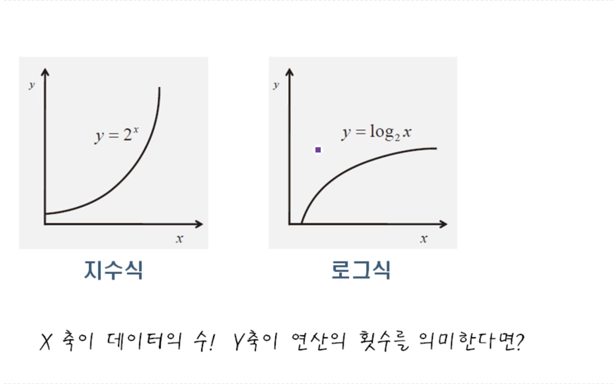
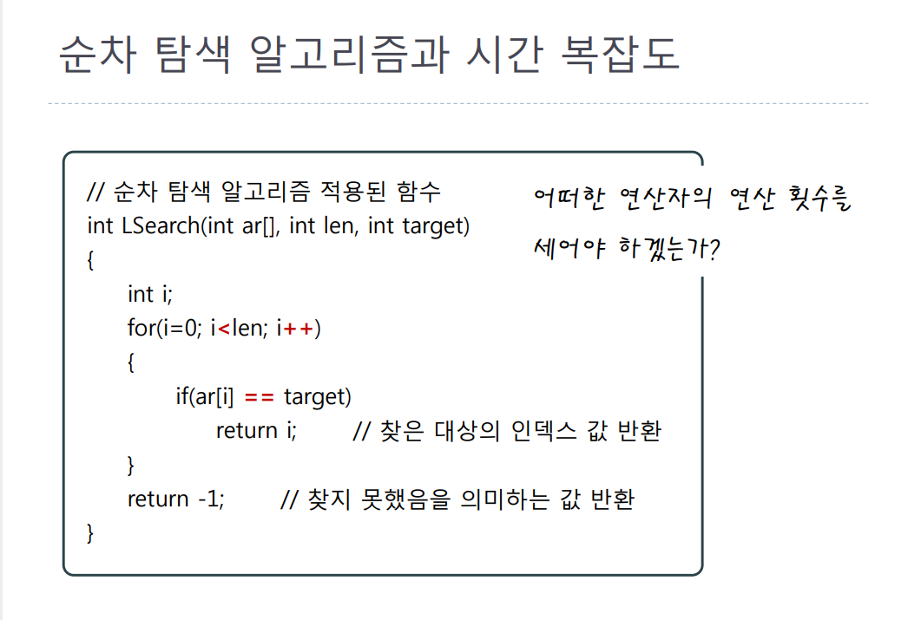

# 알고리즘의 성능 분석 방법

>> *[윤성우님의 열혈 자료구조] 로 공부하였습니다.*

 

[수학과 관련해서 알고 있다고 가정하는 것]

알고리즘을 평가하는 두 가지 요소

* `시간 복잡도` -> 얼마나 빠른가?
* `공간 복잡도` -> 얼마나 메모리를 적게 쓰는가?

<u>시간 복잡도를 더 중요시 합니다!<u>

  
 

시간복잡도의 평가 방법

* 중심이 되는 특정 연산의 횟수를 세어서 평가를 한다.
* 데이터의 수에 대한 연산횟수의 함수 T(n)을 구한다

 

알고리즘의 수행 속도 비교 기준
* 데이터의 수가 적은 경우는 수행속도는 큰 의미가 없다.
* 데이터의 수에 따른 수행 속도의 변화정도를 기준으로 한다.

 

 

예제)

여기서 중요합니다

